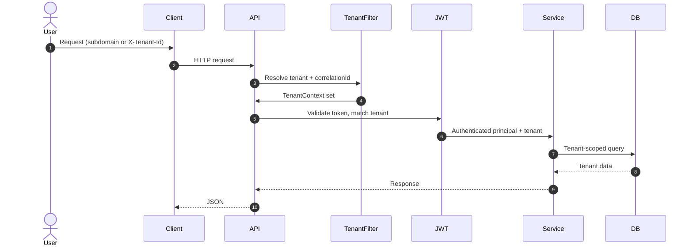

# Architecture

This project demonstrates a shared-database, shared-schema multi-tenant SaaS. The focus is on tenant-safe authentication, authorization, and data access patterns that real SaaS teams can adapt.

## Layering

- `api`: REST controllers and validation
- `application`: core services, metrics, and orchestration
- `domain`: entities and enums
- `infrastructure`: repositories and persistence concerns
- `tenant`: tenant resolution, context, and guard
- `security`: authentication, JWT, and role checks
- `audit`: audit logging
- `config`: infrastructure configuration
- `web`: minimal Thymeleaf UI

## Request Flow

## Tenant Context

- `TenantContextFilter` resolves tenant by header or subdomain.
- `TenantContextHolder` stores the immutable context per request.
- `TenantEntityListener` guards against cross-tenant entity loads.

## Observability

- `correlationId` and `tenantId` are included in JSON logs via MDC.
- Metrics counters are collected per tenant to sell trust.
